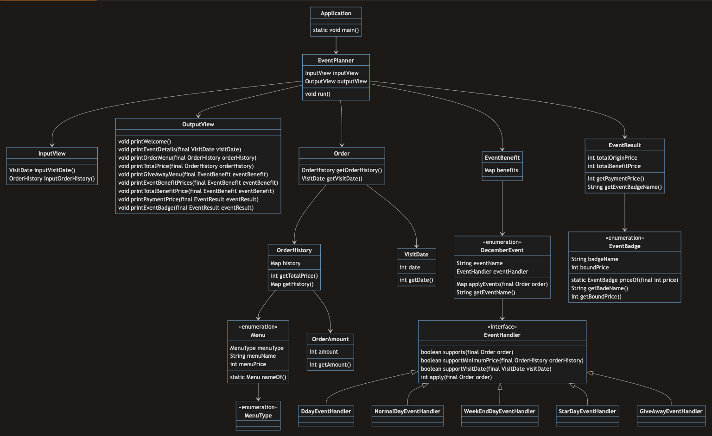

# 크리스마스 프로모션

## 클래스 다이어그램

## 기획 내용

### 목적

1. 중복 할인 + 증정 -> 혜택 체감
2. 올해 12월 금액 > 5년간 12월 판매 금액
    - 정량 지표 없음
3. 12월 이벤트 참여 고객 5% -> 내년 1월 이벤트 참여
    - 정량 지표 없음

### 12월 이벤트

- 크리스마스 D-day 할인
    - 기간 : 2023.12.01 ~ 2023.12.25
    - 1,000 시작
    - 크리스마스까지 날마다 할인 금액 100원 증가
    - 총주문 금액 - 할인 금액
        - 12.01 -> - 1,000
        - 12.25 -> - 3,400
- 이외 이벤트
    - 기간 : 2023.12.01 ~ 2023.12.31
    - 평일 할인 (일 ~ 목)
        - 디저트 메뉴: - 2,023 / 1 메뉴
    - 주말 할인 (금 ~ 토)
        - 메인 메뉴 : - 2,023 / 1 메뉴
    - 특별 할인 (이벤트 달력 별)
        - 총주문 금액 : - 1,000
    - 증정 이벤트
        - 할인 전 총주문 금액 >= 12만 원 (120,000) -> 샴페인 * 1

### 배지 부여

- 총혜택 금액 마다 배지 부여 -> 새해 이벤트 참여
    - ~~총혜택 금액 >= 5,000 -> 별~~
    - ~~총혜택 금액 >= 10,000 -> 트리~~
    - ~~총혜택 금액 >= 20,000 -> 산타~~

### 이벤트 주의 사항

- 이벤트 적용 : 총주문 금액 >= 10,000
- 이벤트 미적용 : 음료만 주문 시
- ~~제한 : 메뉴는 한 번에 최대 20개까지만~~

### 요청 사항

- 입력 받을 것
    - ~~식당 방문 날짜~~
    - ~~주문 메뉴 + 수량~~
- 출력할 것
    - 주문 메뉴
    - 할인 전 총주문 금액
    - 증정 메뉴
    - 혜택 내역
    - 총혜택 금액
    - 할인 후 예상 결제 금액
    - 배지 내용

## 기능 요구 사항

- [x] 방문일
    - [x] 예상 방문 날짜
        - [x] 입력
            - [x] 숫자만 입력 가능
            - [x] 1 ~ 31 값만 가능
                - [x] "[ERROR] 유효하지 않은 날짜입니다. 다시 입력해 주세요." 에러 메시지 출력
            - [x] 모든 에러 메시지는 "[ERROR]" 로 시작하는 메시지 출력
            - [x] 예외 발생 시 입력 재시도

- [x] 주문
    - [x] 주문 메뉴 + 개수
        - ex) 해산물파스타-2, 레드와인-1, 초코케이크-1
        - [x] 메뉴판에 있는 메뉴만 가능
            - [x] 이외 메뉴 입력 시 "[ERROR] 유효하지 않은 주문입니다. 다시 입력해 주세요." 에러 메시지 출력
        - [x] 메뉴-개수 형식에 맞는 주문만 가능
            - [x] 형식 맞지 않을 시 "[ERROR] 유효하지 않은 주문입니다. 다시 입력해 주세요." 에러 메시지 출력
        - [x] 중복되지 않도록 주문
            - ex) 시저샐러드-1, 시저샐러드-1 -> 중복
            - [x] 중복된 메뉴 입력 시 "[ERROR] 유효하지 않은 주문입니다. 다시 입력해 주세요." 에러 메시지 출력
        - [x] 음료만 주문 시 주문 불가
        - [x] 주문 메뉴가 20개 초과 시 주문 불가
        - [x] 모든 에러 메시지는 "[ERROR]" 로 시작하는 메시지 출력

    - [x] 주문 메뉴
        - [x] '<주문 메뉴>' 출력
        - [x] 주문 메뉴 출력 순서 자유롭게 출력
        - [x] 메뉴 출력
        - [x] 개수 출력
            - [x] '개' 출력

    - [x] 할인 전 총주문 금액
        - [x] '<할인 전 총주문 금액>' 출력
        - [x] 천 단위 쉼표
        - [x] '원' 출력

- [x] 이벤트
    - [x] 이벤트 적용
       - [x] 이벤트에 중복 적용되는 경우
       - [x] 아무런 이벤트 적용되지 않는 경우
    - [x] D-Day 할인 이벤트
        - [x] 12.01 1,000원 할인
        - [x] 12.25 3,400원 할인
        - [x] 하루마다 할인금액 100원 증가
        - [x] 총 주문 금액 만원 이상부터 이벤트 적용
    - [x] 평일 할인 이벤트
        - [x] 디저트 메뉴 1개 당 2,023원 할인
        - [x] 총 주문 금액 만원 이상부터 이벤트 적용
    - [x] 주말 할인 이벤트
        - [x] 메인 메뉴 1개 당 2,023원 할인
        - [x] 총 주문 금액 만원 이상부터 이벤트 적용
    - [x] 특별 할인 이벤트
        - [x] 별 있는 날엔 총주문 금액에 1,000원 할인
        - [x] 총 주문 금액 만원 이상부터 이벤트 적용
    - [x] 증정 이벤트
        - [x] 할인 전 총주문 금액 >= 12만 원 일 때만

- [ ] 이벤트 혜택

    - [x] 증정 메뉴
        - [x] '<증정 메뉴>' 출력
        - [x] 할인 전 총주문 금액 >= 12만 원 -> "샴페인 1개" 출력
        - [x] 할인 전 총주문 금액 < 12만 원 -> "없음" 출력
      
    - [x] 혜택 내역
        - [x] '<혜택 내역>' 출력
        - [x] 고객에게 적용된 이벤트 내역만 출력
        - [x] 혜택 내역 출력 순서 자유롭게 출력
        - [x] 이벤트명 출력
        - [x] 이벤트 별 할인 금액 출력
            - [x] 마이너스 출력
            - [x] 천 단위 쉼표
            - [x] '원' 출력
        - [x] 적용 이벤트 X -> 해택 내역 "없음" 출력

    - [ ] 총혜택 금액
        - [ ] '<총혜택 금액>' 출력
        - [ ] 총혜택 금액 = 할인 내역 금액 총합
        - [ ] 마이너스 부호 출력
        - [ ] 천 단위 쉼표
        - [ ] '원' 출력
        - [ ] 없음 -> 0원

    - [ ] 이벤트 배지
        - [ ] '<12월 이벤트 배지>' 출력
        - [ ] 총혜택 금액에 따라 배지 이름 다르게 출력
            - [ ] 총혜택 금액 >= 5,000 -> 별
            - [ ] 총혜택 금액 >= 10,000 -> 트리
            - [ ] 총혜택 금액 >= 20,000 -> 산타
            - [ ] 부여 X -> "없음"

- [ ] 이벤트 결과
    - [ ] 할인 후 예상 결제 금액
        - [ ] '<할인 후 예상 결제 금액>' 출력
        - [ ] 할인 후 예상 결제 금액 = 할인 전 총주문 금액 - 할인 금액
        - [ ] 음수 이면 IllegalStateException

## 프로그래밍 요구 사항

- [ ] JDK 17

- [ ] 라이브러리
    - [ ] 외부 라이브러리 사용 금지
    - [ ] Console API 사용
        - [ ] readLine() : 사용자 입력

- [ ] 객체 지향 생활 체조
    - [ ] 인덴트 최대 2 레벨
    - [ ] 삼항 연산자 금지
    - [ ] 메소드 길이 15라인 상한
    - [ ] else, switch-case 금지

- [ ] 테스트
    - [ ] JUnit5, AssertJ 기능 목록 테스트
    - [ ] 도메인 로직 단위 테스트
    - [ ] UI 로직 제외
    - [ ] 핵심 로직 코드, UI 코드 분리

- [ ] 예외
    - [ ] 사용자의 잘못된 입력에 `IllegalArgumentException` 던지기
    - [ ] `[ERROR] message` 에러메시지 출력
    - [ ] 해당 부분을 다시 입력 받기
    - [ ] Exception 말고, IllegalArgumentException, IllegalStateException 처럼 명확한 예외 던지기

- [ ] 입출력 클래스
    - [ ] 입력, 출력 클래스 분리
    - [ ] 패캐지, 클래스명, 메소드 시그니처 자유롭게 구현

## 제출 요구 사항

- [ ] 원본 repo use template
- [ ] private 저장소 설정
- [ ] woowa-course collaborator 초대
- [ ] main 브랜치에 작업
- [ ] 지원 플랫폼에 등록